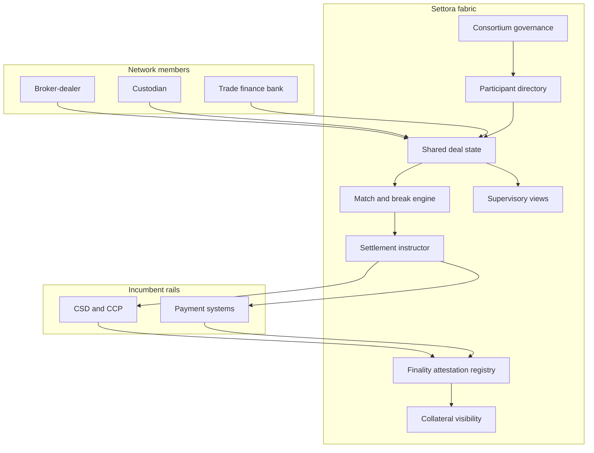

# Settora

**Source:** `ai-in-financial/WEF_The_future_of_financial_infrastructure/`
**Domain:** `ai-fin`
**One-liner:** A multi-party post-trade agreement fabric that replaces bilateral reconciliation with shared trade state, accelerated settlement instructions, and settlement-finality attestations for securities and trade-finance workflows.
**Wedge:** Custodian banks, CSDs/agent banks, and large broker-dealers running equity post-trade and trade-finance document chains who burn cost and capital on breaks, margin lock-up, and multi-day settlement cycles.
**Positioning:** Problem-first market infrastructure, not a blockchain science project. The WEF DLT infrastructure report finds shared ledgers drive operational simplification, settlement-time reduction, counterparty-risk reduction, liquidity improvement, regulatory monitoring, and provenance — but only as one technology among many, and only with deep incumbent–innovator–regulator collaboration. Settora sells the shared-state and finality workflow those value drivers require.

## Market research synthesis

### Thesis from source

The July 2016 Forum report documents a surge of DLT attention — 24+ countries investing, 2,500+ patents in three years, 90+ corporations in consortia, a prediction that 80% of banks would initiate DLT projects by 2017, over US$1.4 billion of venture investment in three years, and 90+ central banks in discussions — while warning that uncertain regulation, weak standardisation, and absent formal legal frameworks block large-scale implementation. Six key findings follow: DLT can simplify infrastructure; it is not a panacea; applications differ by use case; digital identity and digital fiat amplify benefits; the most impactful apps need collaboration that adds complexity and delay; and new infrastructure will question orthodoxies foundational to today’s models.

Six value drivers emerge from nine use-case deep-dives (global payments, P&C claims, syndicated loans, trade finance, CoCos, automated compliance, proxy voting, asset rehypothecation, equity post-trade): eliminate manual reconciliation and disputes; enable real-time regulatory monitoring; codify obligations to reduce counterparty trust needs; accelerate clearing/settlement by disintermediating pure verification hops; free locked capital via liquidity transparency; and establish asset provenance in a single source of truth. The report insists on problem-first design and accepts that DLT is one tool among cloud, cognitive computing, and others. Equity post-trade and trade finance are emblematic multi-party pain: duplicated books of record, reconciliation armies, and settlement cycles that trap collateral.

Settora’s product thesis: the commercially defensible object is shared, permissioned trade state with legally meaningful finality attestations and exception workflows — not a public token network. Incumbents keep roles where regulation and custody demand them; what dies is the need for each party to maintain a privately reconciled mirror of the same facts.

### Buyer & economic model

- **Primary buyer:** Head of Operations / Post-Trade or Chief Operating Officer at a custodian, broker-dealer, or trade-finance bank; market infrastructures (CSD/CCP interfaces) as co-buyers.
- **Users:** settlements analysts, reconciliations teams, collateral/margin managers, corporate-actions ops, trade-finance document checkers, compliance (trade reporting), legal (finality opinions), consortium governors.
- **Budget owner / value metric:** operations cost budget and collateral/liquidity usage. Metrics: breaks per 1,000 trades, mean time to resolve breaks, settlement-cycle compression (e.g., toward T+0/T+1 where legally recognised), collateral freed, and cost-to-income contribution from post-trade ops.
- **Competing status quo:** SWIFT + bilateral matching + custodian portals + spreadsheet exception queues; legacy CSD settlement with multi-day cycles; trade-finance courier/email document sets; point DLT pilots that never cross institutional boundaries.

### Domain constraints

- **Regulatory / trust / safety:** settlement finality and legal enforceability by jurisdiction; CCP and CSD roles cannot be hand-waved away; trade reporting obligations; outsourcing rules; operational resilience and third-party concentration; market-abuse surveillance still needs reliable timestamps and provenance.
- **Data sensitivity:** trade economics, beneficial ownership, financing terms; need-to-know visibility across a transaction graph; no leakage of one client’s positions to another.
- **Change-management realities:** industry utilities move at consortium speed; legal finality may lag technical settlement; “DLT theatre” fails without identity of parties and cash settlement rails. Settora must interoperate with incumbent CSDs/CCPs and fiat payment systems rather than pretending to replace them on day one.

## Business requirements

- BR-1: All permissioned parties to a trade or trade-finance deal must see the same agreed state for matched fields; unexplained local divergence is a break event, not a silent difference.
- BR-2: Settlement instructions generated from agreed state must carry a finality attestation status (provisional, final under named law, void) that legal and ops can rely on.
- BR-3: Reconciliation effort for in-scope matched fields must fall by a target percentage within two settlement quarters of a corridor go-live, measured against the prior bilateral baseline.
- BR-4: Collateral and margin related to in-flight settlements must be visible enough for treasury to reduce precautionary buffers without breaching CCP/CSD requirements.
- BR-5: Corporate actions and trade-finance milestones (document presentment, acceptance, discrepancy) must update shared state with an immutable history for disputes.
- BR-6: Regulators (where authorised) must be able to receive real-time or near-real-time supervisory views without each firm filing a manually reconciled extract.
- BR-7: Identity of counterparties on the network must meet assurance standards; anonymous nodes cannot instruct settlement.
- BR-8: Interoperability with incumbent CSD/CCP and payment rails is mandatory for production corridors; a pure-ledger “cash on chain” path is optional, not blocking.
- BR-9: Exception workflows must time-box breaks with named owners; unresolved breaks escalate before fail-to-settle deadlines.
- BR-10: Asset provenance (rehypothecation chain where applicable) must be queryable for financing desks and risk, within permission rules.
- BR-11: Legal enforceability opinions and jurisdictional finality flags must be versioned beside technical settlement events.
- BR-12: Consortium governance must admit/suspend participants and change schema rules with an auditable vote or rulebook process — no silent operator edits to settled history.

## User stories

Canonical user stories live in sibling [USER_STORIES.md](USER_STORIES.md).

## System design

### Overview

Settora maintains permissioned shared state for selected post-trade and trade-finance workflows. Parties submit assertions; matching rules produce agreed state or breaks. Agreed state drives settlement instructions to incumbent rails (CSD/CCP/payments) and records finality attestations when those rails confirm. Corporate actions and documentary milestones append to the same deal graph. Supervisory nodes can subscribe to permitted views. Governance controls membership, schemas, and rulebook versions. Provenance queries serve financing and risk use cases such as rehypothecation chains.

### Actors & boundaries

- **Actors:** broker-dealers, custodians, agent banks, CSDs/CCPs, trade-finance banks/corporates, regulators (observer), Settora operator, end investors (indirect).
- **Trust boundary:** Settora is the shared agreement and instruction layer. Legal settlement finality remains with recognised systems under applicable law unless and until statute recognises ledger finality. Client assets remain with custodians; Settora does not take proprietary risk.
- **Human-in-the-loop points:** break resolution; discrepancy acceptance in trade finance; membership suspension; finality-opinion updates; schema changes.

### Core capabilities

1. **Participant directory and permissions** — need-to-know visibility.
2. **Shared trade / deal state** — matched fields, version history.
3. **Break detection and exception workflow** — time-boxed resolution.
4. **Settlement instruction generation** — to incumbent rails.
5. **Finality attestation registry** — jurisdictional status.
6. **Collateral and in-flight visibility** — liquidity signals.
7. **Corporate actions and documentary milestones** — append-only events.
8. **Provenance queries** — asset and rehypothecation history.
9. **Supervisory views** — authorised regulatory monitoring.
10. **Consortium governance** — membership, schema, rulebook versions.

### Conceptual data

- **Primary entities:** Participant, TradeDeal, StateAssertion, AgreedState, BreakCase, SettlementInstruction, FinalityAttestation, CollateralLock, CorporateActionEvent, DocumentMilestone, ProvenanceRecord, SupervisorySubscription, RulebookVersion, GovernanceVote.
- **Critical events:** assertion submitted, state agreed, break opened/resolved, instruction sent, finality recorded, collateral released, milestone attested, participant suspended.
- **Retention / audit needs:** agreed state, instructions, finality attestations, and break resolutions retained for settlement and litigation windows; cryptographic integrity of history required for dispute evidence.

### Integrations (conceptual)

- **Systems of record:** OMS/EMS, custodian accounting, CSD/CCP interfaces, trade-finance platforms, collateral management systems.
- **Upstream signals:** market data for corporate actions, identity/assurance services, payment confirmations.
- **Downstream actions:** settlement rail instructions, regulatory reports, treasury collateral movements, dispute evidence packs.

### High-level architecture

Agreement is shared; cash and securities movement still traverse incumbent rails until legal finality migrates. That hybrid is intentional per the source’s “not a panacea” finding.

### Success metrics

- **Leading:** match rate; breaks per 1,000 trades; median break resolution time; % instructions auto-generated from agreed state; supervisory view adoption where permitted.
- **Lagging:** settlement-cycle time for in-scope corridors; collateral/margin released versus baseline; post-trade ops cost per trade; fail rates; legal exceptions where finality attestation mismatched rail outcome.

## OpenAPI skeleton

Canonical HTTP surface lives in sibling [openapi.yaml](openapi.yaml). Summary:

- **Base path:** `/v1/...`
- **Auth:** `X-API-Key` for participant systems; Bearer JWT for ops and governors.
- **Resource groups:** Participants, Deals, Breaks, Settlements, Finality, Collateral, Governance.
