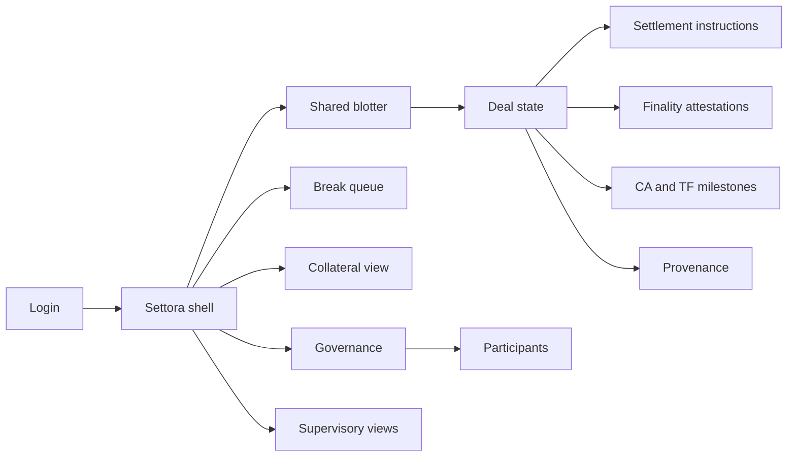
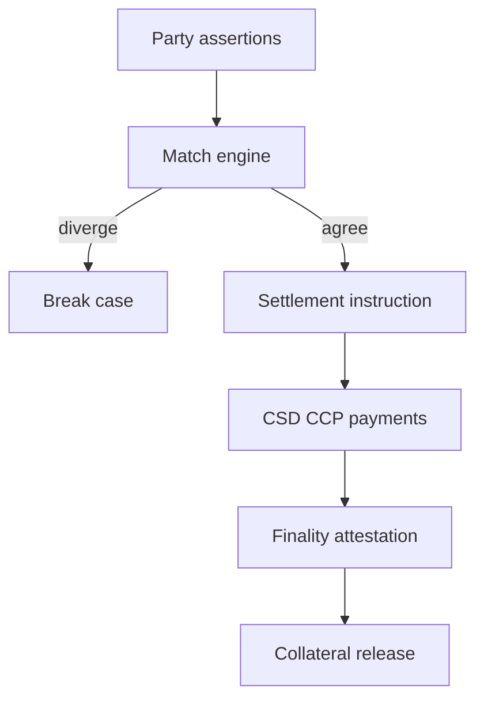

# Settora — Web app

**Product:** [PRODUCT.md](./PRODUCT.md)
**Primary surface:** Multi-party post-trade agreement console (settlements / collateral / trade-finance / consortium ops)
**Secondary surfaces:** Supervisory observer view (authorised regulators); finality opinion registry (legal read)
**Design thesis:** Settora is a shared blotter that ends bilateral mirror books — the UI metaphor is agreed state and finality seals on a dealing-room slate, not a crypto explorer. Visual language is night-blue chalk panels with tungsten amber for breaks and mint finality seals: matched fields feel single-sourced; unexplained divergence feels like a break ticket; provisional vs final under named law feels legally distinct. The Settora wordmark sits as a quiet market-infra stamp on every deal and instruction screen so counterparties know whose shared state they are settling against—not a public token chain.

## UX research synthesis

### Category peers (best-in-class)

- **DTCC / Euroclear settlement and exception UIs:** Break queues, instruction status, fail management. Steal: time-boxed breaks with named owners before fail deadlines (BR-9); reject retail crypto wallet aesthetics.
- **Symphony / Bloomberg post-trade ops patterns:** Dense multi-party trade context. Steal: field-level disagreement highlighting; reject chat-as-system-of-record for settlement state.
- **Trade finance platforms (e.g. Contour / letter-of-credit digitalisation):** Documentary milestones on shared deal state. Steal: presentment/acceptance/discrepancy events with attestations (BR-5); reject email-thread UX.
- **CSD participant portals:** Instruction to rail and status. Steal: hybrid instruct-to-incumbent-rails (BR-8); reject “cash on chain or nothing” as blocking.

### Patterns to adopt / reject

- **Adopt:** Shared agreed state as home object; break = unexplained local divergence; finality attestation statuses (provisional/final/void) with jurisdiction; collateral in-flight visibility; corporate-action and TF milestones append-only; supervisory subscriptions; provenance queries; consortium admit/suspend with rulebook votes; no silent edits to settled history.
- **Reject:** Public blockchain explorers as primary UI; purple DLT marketing; replacing CSD/CCP on day one; anonymous settlement instruct; editable settled history.

### Trust, density, and workflow constraints from PRODUCT.md

Legal finality remains with recognised systems until statute catches up (trust boundary). Need-to-know across transaction graph — no client position leakage. Consortium speed and legal opinions lag tech — finality flags versioned beside events (BR-11). Identity assurance required to instruct (BR-7). Interop with CSD/CCP/payments mandatory (BR-8).

## Information architecture

### Nav model

### Roles → default home

| Role | Default home | Why |
|------|--------------|-----|
| Settlements analyst | Shared blotter / breaks | Single instruction, field conflicts (BR-1, BR-9) |
| Collateral / margin manager | Collateral in-flight | Free capital on finality (BR-4) |
| Trade-finance ops | Deal milestones | Docs + payment on one state (BR-5) |
| Compliance / reporting | Supervisory subscriptions | Near-real-time agreed fields (BR-6) |
| Consortium governor / legal | Governance + finality opinions | Suspend, rulebook, jurisdiction (BR-11, BR-12) |

### Cross-links to OpenAPI resources

| Nav area | OpenAPI tags / resources |
|----------|---------------------------|
| Membership / permissions | Participants |
| Shared deal state | Deals |
| Exception workflows | Breaks |
| Instructions to rails | Settlements |
| Jurisdictional finality | Finality |
| Margin / locks | Collateral |
| Rulebook / suspension | Governance |

## Screen inventory

### Shared blotter home

- **Purpose:** Answer “what’s agreed, what’s broken, what’s awaiting finality?” across corridors.
- **Entry:** Settlements default.
- **Layout regions:** Brand stamp; corridor filters; deal table (match status, break count, instruction status, finality); alerts rail (fail deadlines).
- **Primary actions:** Open deal; open break; export ops pulse.
- **Empty / loading / error:** Empty = onboard first corridor participants; error = retry with request id.
- **BR / story ties:** BR-1; settlements analyst stories.

### Deal shared state

- **Purpose:** Single agreed state for matched fields; divergence opens breaks — not silent difference.
- **Entry:** From blotter.
- **Layout regions:** Deal header; agreed field grid; party assertion compare; history; permission scope indicator.
- **Primary actions:** Submit assertion; generate instruction; open break; freeze disputed fields.
- **Empty / loading / error:** Local-only fields marked; unexplained divergence = auto break (BR-1).
- **BR / story ties:** BR-1, BR-12 freeze story.

### Break exception workspace

- **Purpose:** Conflicting fields highlighted; time-boxed owners; escalate before fail-to-settle.
- **Entry:** Breaks queue; deal alert.
- **Layout regions:** Conflict field diff; owner; deadline countdown; escalation path; resolution log.
- **Primary actions:** Assign; resolve; escalate; link evidence.
- **Empty / loading / error:** Empty = healthy; overdue = coral (BR-9).
- **BR / story ties:** BR-3, BR-9.

### Settlement instruction desk

- **Purpose:** Instructions from agreed state to incumbent CSD/CCP/payment rails.
- **Entry:** Deal → Instruct.
- **Layout regions:** Instruction preview; rail target; send status; ack/nack; link to finality.
- **Primary actions:** Send; cancel pre-rail; retry; open rail ticket.
- **Empty / loading / error:** Cannot instruct without agreed state / assured participant (BR-7, BR-8).
- **BR / story ties:** BR-8.

### Finality attestation registry

- **Purpose:** Provisional / final under named law / void — legal meaning beside technical events.
- **Entry:** Deal; legal registry.
- **Layout regions:** Status seal; jurisdiction; opinion version; rail confirmation link; void reason.
- **Primary actions:** Record attestation; update opinion version; query by corridor.
- **Empty / loading / error:** Mismatch rail vs attestation = exception (BR-2, BR-11).
- **BR / story ties:** BR-2, BR-11; legal stories.

### Collateral and in-flight visibility

- **Purpose:** See what’s locking margin; free when finality achieved; early fail warning.
- **Entry:** Collateral manager home.
- **Layout regions:** Lock table; finality progress; fail-risk signals; treasury actions.
- **Primary actions:** Release on finality; pre-fund on fail risk; export ALM feed.
- **Empty / loading / error:** Incomplete visibility = amber (BR-4).
- **BR / story ties:** BR-4.

### Corporate actions and TF milestones

- **Purpose:** Append-only events (CA entitlements; document presentment/acceptance/discrepancy) on same deal graph.
- **Entry:** Deal → Milestones; TF ops home.
- **Layout regions:** Milestone timeline; attestor identity; discrepancy pane; freeze disputed entitlement fields.
- **Primary actions:** Attest milestone; raise discrepancy; freeze fields; continue rest of book.
- **Empty / loading / error:** Email-not-allowed empty state nudges to attest here (BR-5).
- **BR / story ties:** BR-5; TF and dispute stories.

### Provenance query

- **Purpose:** Asset / rehypothecation chain within permissions for financing desks and risk.
- **Entry:** Risk / financing; deal tool.
- **Layout regions:** Chain graph; permission-filtered nodes; export.
- **Primary actions:** Query; export evidence pack.
- **Empty / loading / error:** Unauthorised nodes omitted, not guessed (BR-10).
- **BR / story ties:** BR-10.

### Supervisory views

- **Purpose:** Authorised regulators subscribe to agreed fields without manual reconcile-then-report.
- **Entry:** Compliance; regulator observer login.
- **Layout regions:** Subscription scopes; near-real-time feed; immutable timestamps; export.
- **Primary actions:** Grant subscription; audit access; export extract.
- **Empty / loading / error:** Unauthorised = deny (BR-6).
- **BR / story ties:** BR-6.

### Participant directory

- **Purpose:** Assured members; need-to-know permissions; anonymous cannot instruct.
- **Entry:** Governance; ops.
- **Layout regions:** Member table; assurance; permission scopes; suspension status.
- **Primary actions:** Admit; suspend; adjust permissions.
- **Empty / loading / error:** Suspended cannot instruct (BR-7, BR-12).
- **BR / story ties:** BR-7, BR-12.

### Consortium governance

- **Purpose:** Rulebook/schema changes via auditable vote; no silent operator edits to settled history.
- **Entry:** Governor home.
- **Layout regions:** Rulebook versions; open votes; schema diffs; decision audit; settled-history immutability banner.
- **Primary actions:** Propose change; vote; publish version; suspend participant.
- **Empty / loading / error:** Edit attempt on settled history = refused (BR-12).
- **BR / story ties:** BR-12.

## Key flows

1. **Match to settle** — assertions → agreed state → instruction to rail → finality attestation → collateral release; failure: break on divergence.

2. **Break to deadline** — open break → highlight fields → assign owner → resolve or escalate before fail (BR-9).

3. **Trade-finance milestone** — presentment → acceptance/discrepancy → append state → payment obligation aligned (BR-5).

4. **Supervisory pull** — authorised subscription → agreed fields stream → no bilateral extract (BR-6).

5. **Dispute freeze** — CA entitlement dispute → freeze disputed fields → rest of book continues.

## Design system

### Tokens (CSS variables)

- `--color-ink: #E6EDF5` — text on slate
- `--color-slate: #0D1520` — app ground
- `--color-panel: #152033` — chalk panels
- `--color-tungsten: #E0A23A` — breaks / provisional
- `--color-final-mint: #3CB89A` — final under law
- `--color-void-red: #D9534F` — void / overdue fail
- `--color-steel: #7A8B9C` — secondary labels
- `--font-display: "IBM Plex Sans", sans-serif` — blotter density (institutional)
- `--font-mono: "IBM Plex Mono", monospace` — deal ids, ISINs, timestamps
- `--space-1`…`--space-8`: 4px scale
- `--radius-sm: 2px`; `--radius-md: 4px` — market infra sharp
- `--motion-match: 160ms ease-out` — agree flash
- `--motion-break: 240ms ease-in-out` — break pulse
- `--motion-final: 200ms ease-out` — finality seal
- Atmosphere: night dealing-room slate; chalk grid; tungsten break lights; no neon crypto; no purple chain motifs.

### Typography & brand

- Plex Sans for blotter; mono for ids and timestamps.
- Settora stamp on deal and instruction views; login brand-first (“Shared state. Jurisdictional finality.”); one CTA — no token price widget.

### Do / don’t

- **Do:** Highlight conflicting fields; show finality jurisdiction; instruct incumbent rails; time-box breaks; immutable settled history.
- **Don’t:** Purple DLT glow; public explorer chrome; anonymous instruct; editable settled rows; emoji status; card grids for static metrics.

### Accessibility & domain trust cues

- Break/finality states include text seals; live regions for deadline escalation.
- Focus order: deal → break → instruct → finality → collateral.
- Supervisory views high contrast; timestamp text always present.

## Component patterns

- **AgreedStateGrid** — matched fields with assertion compare.
- **BreakFieldDiff** — conflicting fields highlighted.
- **FinalitySeal** — provisional / final-under-law / void + jurisdiction.
- **RailInstructionRow** — CSD/CCP/payment send status.
- **CollateralLockTable** — in-flight margin with release on finality.
- **MilestoneTimeline** — CA/TF append-only events.
- **ProvenanceChain** — permission-filtered rehypothecation path.
- **SupervisorySubscription** — scoped regulator feed.
- **RulebookVoteCard** — governance change with audit.
- **SettledHistoryLock** — refuse silent edits.

## Out of scope for v1 web

- Public permissionless chain UI; replacing CSD/CCP legal roles; retail investor trading app; native mobile trader; crypto token issuance; full market-abuse surveillance suite (timestamps only as input).
